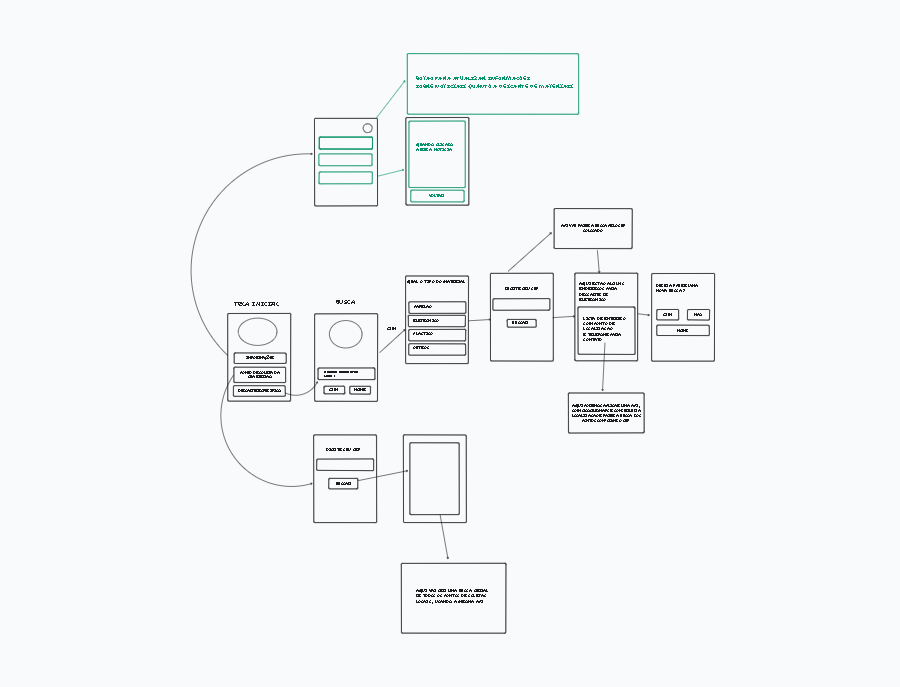

Sistema de Localização de Pontos de Coleta e Descarte

Visão Geral

Objetivo

Facilitar o acesso dos usuários a informações sobre coleta e descarte correto de materiais, utilizando uma interface intuitiva e integração com uma API de localização via CEP.

Visão de Negócio

Problema Resolvido: Dificuldade de encontrar locais apropriados para o descarte de materiais recicláveis.

Público-Alvo: Usuários interessados em descarte ecológico e informações sobre coleta seletiva.

Benefícios: Redução de lixo inadequado no meio ambiente, aumento da reciclagem e conscientização ambiental.

Funcionalidades

Tela Inicial

Contém três botões principais:

Informações: Direciona para uma tela com notícias e artigos sobre reciclagem e meio ambiente.

Pontos de Coleta: Solicita um CEP e exibe uma lista de locais próximos para coleta, utilizando uma API de localização.

Descarte Específico: O usuário escolhe o tipo de material a ser descartado (papelão, eletrônicos, plástico, outros). Após a escolha, solicita um CEP e exibe endereços adequados para descarte.

Fluxo de Navegação

Tela Inicial → Seleciona opção

Informações → Exibe notícias

Pontos de Coleta → Solicita CEP → Exibe locais

Descarte Específico → Escolhe tipo de material → Solicita CEP → Exibe endereços

Tela Final: Opção de nova busca ou retorno para a Home.

Especificação Técnica

Tecnologias Utilizadas

Frontend: React Native (para app) ou React.js (para web)

Backend: Node.js com Express.js

Banco de Dados: PostgreSQL ou MongoDB

APIs:

API de Localização (Google Maps API ou OpenStreetMap)

API de notícias ambientais (opcional)

Autenticação: Firebase Authentication ou JWT

Arquitetura

Frontend

React com componentes reutilizáveis.

Axios para consumo das APIs.

Context API ou Redux para gestão de estado.

Backend

API RESTful com endpoints para consulta de pontos de coleta e descarte.

Integração com banco de dados.

Middleware para controle de acessos e autenticação.

Considerações Finais

O projeto visa facilitar a reciclagem e descarte consciente.

Possibilidade de expansão com mais tipos de materiais e parcerias.

Opção de gamificação para incentivar o uso.

🚀 Este documento pode ser atualizado conforme avanço do projeto. Dúvidas e sugestões podem ser encaminhadas à equipe de desenvolvimento.

